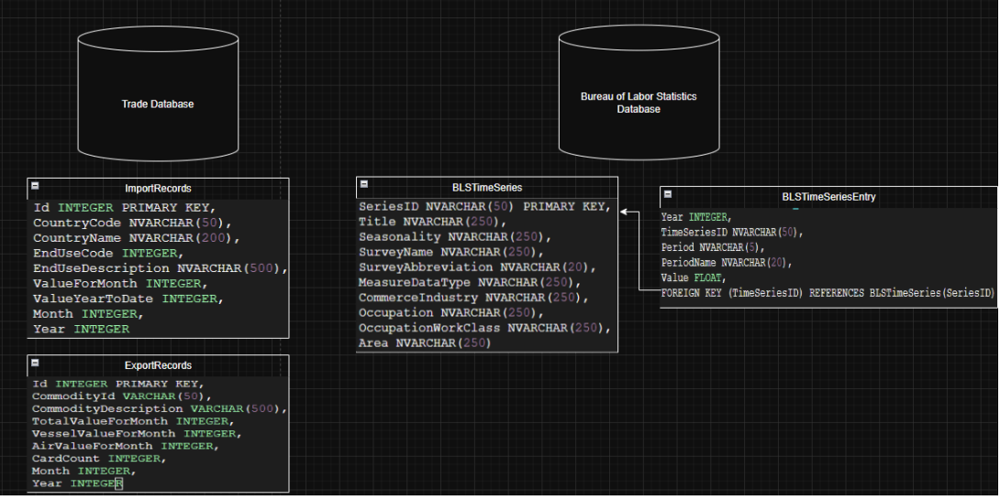
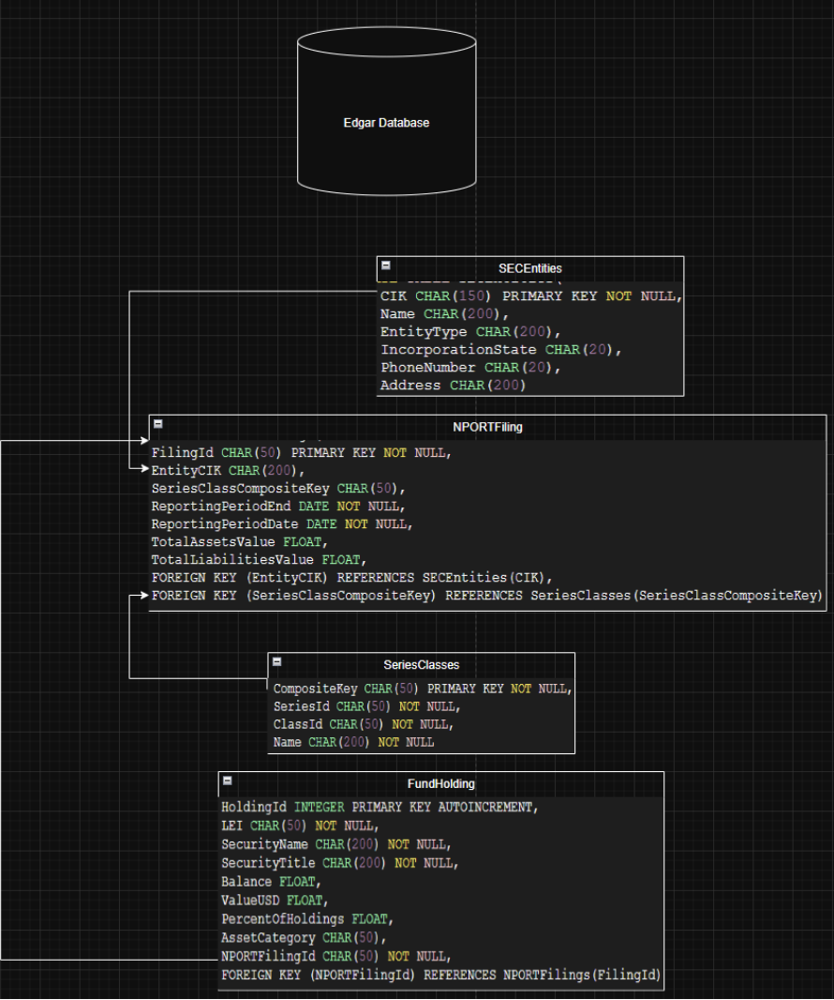
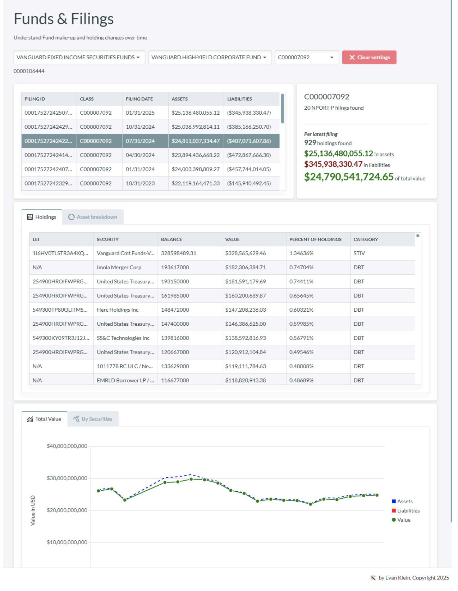
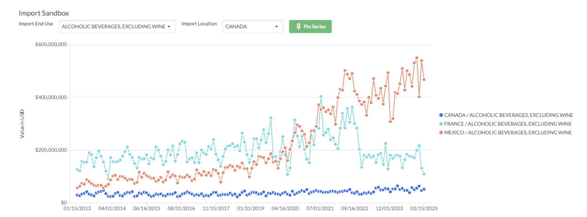

# Watchdog

_Watchdog_ is a data pipeline and web application for displaying financial data from three sources:
- **Bureau of Labor Statistics**: Time series data provided from the Bureau of Labor Statistics - examples include CPI averages for a number of goods, insurance premiums rates, and more.
- **U.S. Census API**: Trade data (exports and imports) pulled from monthly reports provided by the U.S. Census Bureau
- **EDGAR Database**: SEC filings related to fund security and investment holdings.

Via data pipelines utilizing these three data sources, a rich dataset of financial and economic data can be compiled which is then used by the **Watchdog web interface** to provide a rich analytical dashboard.

Data pipelines are written in Python. Web application is written with Blazor, .NET 9, and the [Radzen component library](https://www.radzen.com/).

This project was developed for my M.S. in Data Science at Indiana University as part of the curriculum for I535 - Management, Access, and Use of Big Data. All work is my own.

## Database Schemas

## Web Interface (Screenshots)

